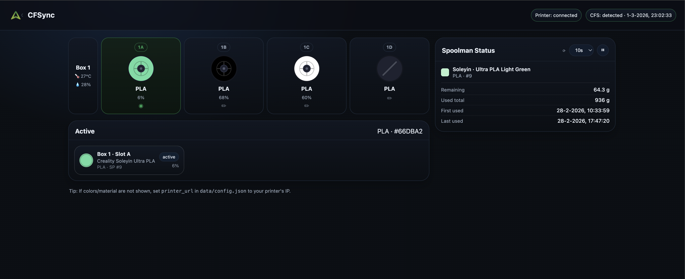
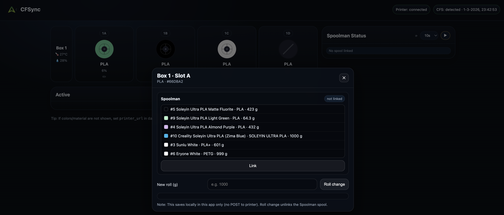

# CFSync

A local web dashboard for managing filament spools on **Creality K1 series printers with CFS** (Colour Filament System), including the K1, K1C, K1 Max, K1 SE, and K2 Plus. CFSync connects directly to the printer over WebSocket, reads live spool data from all CFS slots, and optionally syncs consumption back to [Spoolman](https://github.com/Donkie/Spoolman).



## Features

- Live CFS slot view — filament colour, material, and fill level per slot
- RFID spool percent from printer sensor; calculated percent for non-RFID spools via Spoolman
- Spoolman integration — link spools, track remaining weight, auto-report usage at job end
- Moonraker job tracking — attributes `filament_used` proportionally across active slots at print completion
- Printer name and firmware version shown in header (read from WebSocket)
- Dark UI, no build step, runs as a systemd service

## Requirements

- Linux host on the same network as the printer (e.g. a Pi or the printer's companion board)
- Creality K1 series printer with CFS (K1, K1C, K1 Max, K1 SE, K2 Plus)
- Python 3.10+
- Optional: [Spoolman](https://github.com/Donkie/Spoolman) for spool tracking

## Install

```bash
sudo bash <(curl -fsSL https://raw.githubusercontent.com/koen01/Filament-Management/main/install.sh)
```

The installer will prompt for:

| Prompt | Example |
|---|---|
| UI port | `8005` |
| Printer IP | `192.168.1.144` |
| Spoolman URL *(optional)* | `http://192.168.1.10:7912` |

After install, open `http://<host-ip>:<port>` in your browser.

## Configuration

Settings are stored in `data/config.json`:

```json
{
  "printer_url": "192.168.1.144",
  "filament_diameter_mm": 1.75,
  "spoolman_url": "http://192.168.1.10:7912"
}
```

## Spoolman — RFID auto-linking

CFSync can automatically link a CFS slot to the correct Spoolman spool when an RFID tag is detected — no manual selection needed.

**How it works:** when you manually link a spool to a slot (via the slot modal), CFSync writes the slot's RFID tag ID into a custom extra field on that spool in Spoolman (`cfs_rfid`). Next time the same RFID tag is detected in any slot, CFSync looks up the matching spool and links it automatically.

**Setup in Spoolman:**

1. Open Spoolman → **Settings** → **Extra fields**
2. Add a new extra field:
   - **Name:** `cfs_rfid`
   - **Field type:** Text
3. Save — no further configuration needed

After that, just link each physical spool once via the CFSync slot modal while the spool is loaded. The RFID is written to Spoolman automatically. From then on, inserting that spool into any CFS slot will auto-link it.



> **Note:** RFID tags are only present on spools with a Creality RFID chip. Spools without RFID can still be linked manually.

## Workflow — adding a new spool with RFID

This is the recommended flow when opening a new spool and adding it to Spoolman with full RFID auto-linking:

1. **Write the RFID tag and add to Spoolman** using [SpoolID](https://play.google.com/store/apps/details?id=dngsoftware.spoolid) (Android). The app writes a unique ID to the Creality RFID chip and can add the spool directly to your Spoolman instance in one step.
2. **Load the spool** into a CFS slot.
3. **Open CFSync** → click the slot → select the matching spool from the Spoolman list → click **Link**. CFSync writes the RFID to the spool's `cfs_rfid` field in Spoolman automatically.

From this point on, inserting that spool into any CFS slot will auto-link it — no manual action needed. Filament consumption is reported back to Spoolman after each print.

> Spools without a Creality RFID chip skip step 1 and must be linked manually each time they are loaded.

## Update

```bash
sudo bash <(curl -fsSL https://raw.githubusercontent.com/koen01/Filament-Management/main/update.sh)
```

## Logs

```bash
sudo journalctl -u filament-management -f
```

## Credits

- [jkef80/Filament-Management](https://github.com/jkef80/Filament-Management) — original Moonraker-based filament management that this project evolved from
- [DaviBe92/k2-websocket-re](https://github.com/DaviBe92/k2-websocket-re) — reverse-engineered Creality K2 WebSocket protocol documentation that made the CFS integration possible
